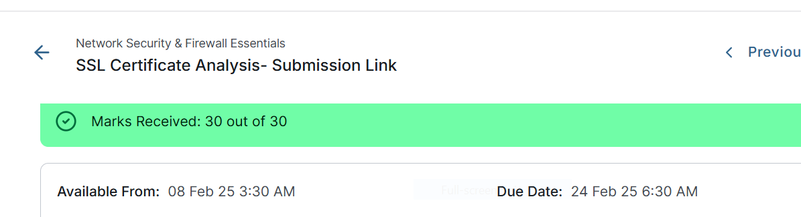

# SSL/TLS Certificate Security Analysis

**Project completed:** 2025  
**Published to GitHub portfolio:** 2026  
**Assessment result:** 30/30

## 🔎 Project Overview

This project demonstrates practical analysis of SSL/TLS digital certificates and Public Key Infrastructure (PKI).

The assessment involved examining certificate fingerprints, Subject Alternative Names (SANs), certificate-chain information, serial numbers, certificate versions and certificate revocation information.

The analysis was performed using the SSL certificate associated with GitHub as the primary certificate example.

---

## 🎯 Project Objectives

- Identify SHA-256 certificate fingerprints
- Identify SHA-256 public-key fingerprints
- Examine Subject Alternative Names (SANs)
- Analyze the SSL/TLS certificate chain
- Identify certificate serial numbers
- Verify certificate versions
- Understand server, intermediate and root certificates
- Investigate certificate revocation information
- Review Certificate Revocation List (CRL) data

---

## 🔐 SHA-256 Fingerprint Analysis

The certificate analysis identified the following SHA-256 values:

### Certificate Fingerprint

`b8bb81876833873942045a8df8f06219e00602ebcb4384c7abc24f18379c87f5`

### Public Key Fingerprint

`7b8c2ef21f5e2cd78d520e9c55be601963343ec88cf4cde2dc4df6a8a3a40706`

Certificate fingerprints provide a unique cryptographic representation of a digital certificate and can be used to verify certificate integrity and identity.

---

## 🌐 Subject Alternative Names

The certificate contained the following Subject Alternative Name entries:

- `DNS: github.com`
- `DNS: www.github.com`
- `IP: 102.91.104.163`

Subject Alternative Names allow a certificate to identify additional domain names or IP addresses that the certificate is valid for.

---

## 🔗 Certificate Chain Analysis

The SSL/TLS certificate chain contained three certificate levels.

| Certificate Level | Certificate Authority / Subject | Version |
|---|---|---|
| Server | github.com | Version 3 |
| Intermediate | Sectigo ECC Domain Validation Secure Server CA | Version 3 |
| Root | USERTrust ECC Certification Authority | Version 3 |

---

## 🔢 Certificate Serial Numbers

### Server Certificate — github.com

`00:AB:66:86:B5:62:7B:E8:05:96:82:13:30:12:86:49:F5`

### Intermediate Certificate

**Sectigo ECC Domain Validation Secure Server CA**

`00:F3:64:4E:6B:6E:00:50:23:7E:09:46:BD:7B:E1:F5:1D`

### Root Certificate

**USERTrust ECC Certification Authority**

`5C:8B:99:C5:5A:94:C5:D2:71:56:DE:CD:89:80:CC:26`

---

## 🚫 Certificate Revocation Analysis

The project also investigated certificate revocation using Certificate Revocation List (CRL) information.

The serial number investigated was:

`00c3d428c3788ec5c14b440753b1a98ad6`

The certificate was identified as revoked on:

**Tuesday, October 24, 2023 at 10:32:59 PM**

This exercise demonstrated how CRL distribution points can be used to verify whether a digital certificate has been revoked by a Certificate Authority.

---

## 🛡️ Skills Demonstrated

- SSL/TLS Certificate Analysis
- Public Key Infrastructure (PKI)
- Digital Certificates
- SHA-256 Fingerprints
- Certificate Chain Validation
- Subject Alternative Names
- Certificate Authorities
- Certificate Serial Number Analysis
- Certificate Revocation Lists
- CRL Analysis
- HTTPS Security
- Network Security
- Cryptography Fundamentals

---

## 📈 Key Takeaways

This project strengthened my understanding of how SSL/TLS certificates establish trust and secure communications on the internet.

It also demonstrated how certificate fingerprints, certificate chains, SAN entries, serial numbers and revocation information can be analyzed during cybersecurity investigations.

Understanding certificate validity and revocation is important when investigating potentially compromised, fraudulent or untrusted certificates.

---

## 📸 Project Screenshots

### 1. Assessment Result — 30/30

---

## 📄 Project Evidence

The completed SSL Certificate Analysis submission is included in this repository as supporting evidence.

[📄 View SSL Certificate Analysis Submission](SSL%20Certificate%20Analysis-%20Submission.doc)

The project evidence demonstrates SHA-256 fingerprint analysis, Subject Alternative Name inspection, certificate-chain analysis, certificate serial-number verification and CRL-based certificate-revocation investigation.

**Assessment result:** 30/30

[🏆 View Assessment Result](screenshots/ssl-assessment-30-of-30-clean.png)

---

## 👨‍💻 Author

**Benard Obi Kekong**

Cybersecurity Analyst | CompTIA Security+ | SOC & GRC | Microsoft Sentinel | SIEM | Risk Assessment | Python
Cybersecurity Analyst | CompTIA Security+ | SOC & GRC | Microsoft Sentinel | SIEM | Risk Assessment | Python
